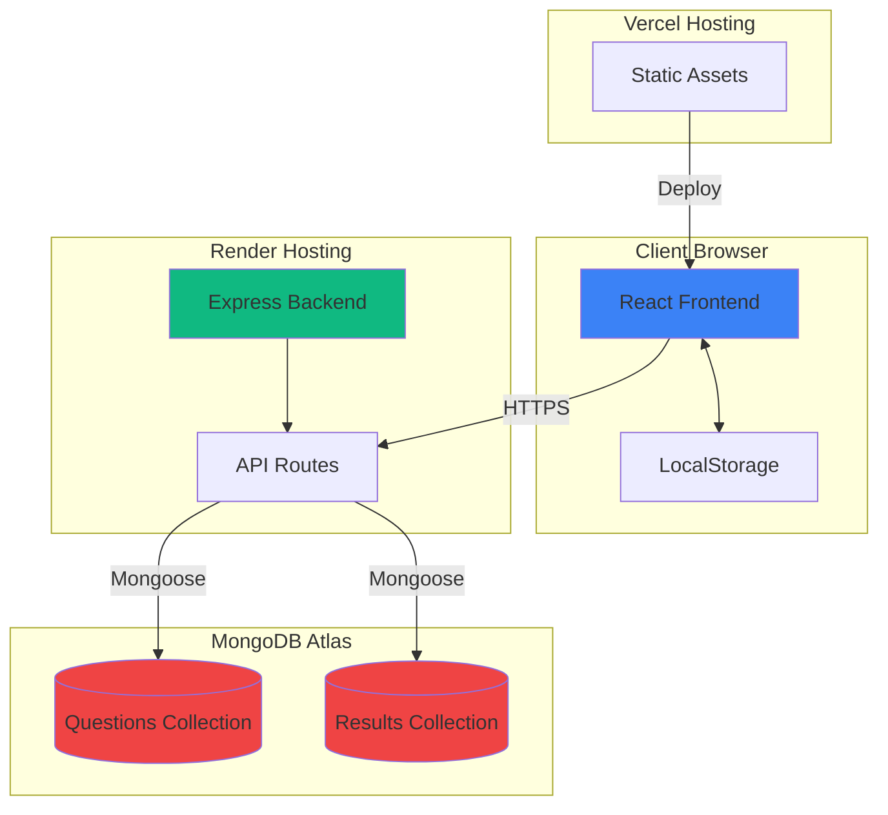
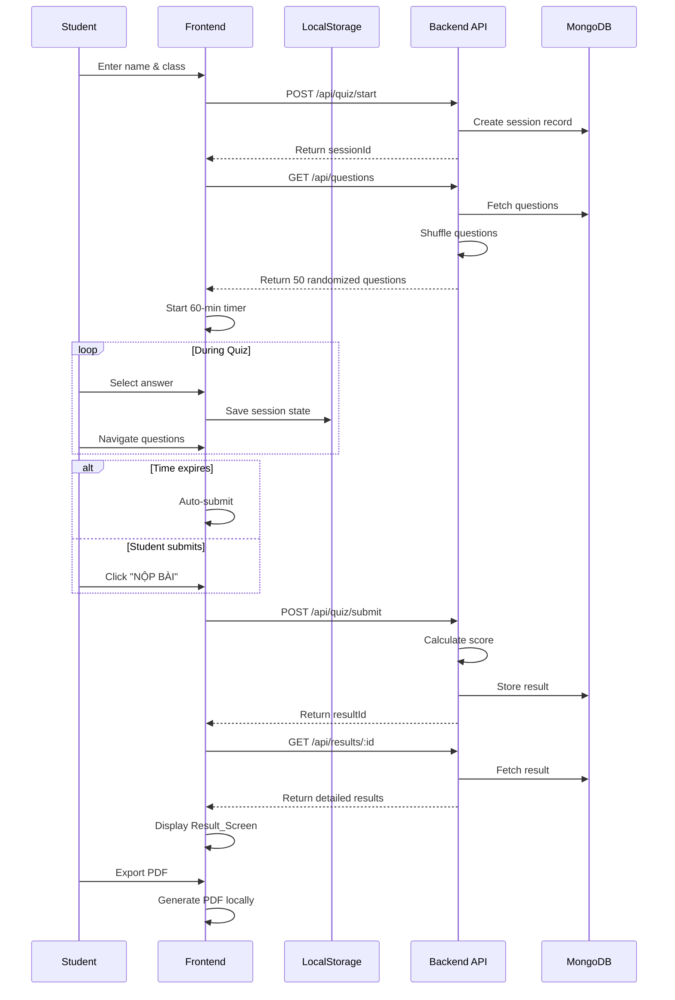

# Design Document: English Quiz Website

## Overview

The English Quiz Website is a full-stack web application designed to deliver timed English proficiency assessments based on the Voices Pre-Intermediate A2-B1 curriculum. The system consists of three main components:

1. **Frontend Client**: A React-based single-page application providing an interactive quiz interface
2. **Backend API**: A Node.js/Express server handling business logic, quiz grading, and data persistence
3. **Database**: A MongoDB Atlas instance storing quiz questions and student results

### Key Design Principles

- **Separation of Concerns**: Clear boundaries between presentation (React), business logic (Express), and data (MongoDB)
- **Stateless Backend**: Quiz session state managed client-side with localStorage for resilience
- **Responsive Design**: Mobile-first approach ensuring usability across all device sizes
- **User Experience**: Smooth transitions, keyboard shortcuts, and auto-save functionality
- **Data Persistence**: All quiz results permanently stored for future analysis

### Question Randomization Strategy

**Important**: The 50 questions will be **shuffled randomly** from the question bank rather than presented in sequential unit order. This ensures:
- Varied test experiences for students taking multiple attempts
- Prevention of pattern memorization
- More authentic assessment conditions

The randomization will occur on the backend when questions are fetched, ensuring all students in a session receive the same randomized order for fairness.

## Architecture

### High-Level Architecture



### Technology Stack

**Frontend**:
- React 18+ (UI framework)
- Tailwind CSS (styling)
- Lucide React (icons)
- jsPDF (PDF generation)
- Recharts (pie chart visualization)
- Axios (HTTP client)

**Backend**:
- Node.js 18+ (runtime)
- Express 4+ (web framework)
- Mongoose (MongoDB ODM)
- CORS (cross-origin resource sharing)
- dotenv (environment configuration)

**Database**:
- MongoDB Atlas (cloud database)

**Deployment**:
- Frontend: Vercel (static hosting with CDN)
- Backend: Render (container-based hosting)
- Database: MongoDB Atlas (managed database service)

### System Flow



## Components and Interfaces

### Frontend Components

#### 1. App Component
**Responsibility**: Root component managing application state and routing between screens

**State**:
```typescript
interface AppState {
  currentScreen: 'start' | 'quiz' | 'result';
  sessionId: string | null;
  resultId: string | null;
  studentInfo: {
    name: string;
    class: string;
  } | null;
}
```

**Methods**:
- `handleStartQuiz(name: string, class: string)`: Initialize quiz session
- `handleSubmitQuiz(resultId: string)`: Transition to results
- `handleRetakeQuiz()`: Reset to start screen

#### 2. StartScreen Component
**Responsibility**: Collect student information and initiate quiz

**Props**:
```typescript
interface StartScreenProps {
  onStart: (name: string, class: string) => Promise<void>;
}
```

**State**:
```typescript
interface StartScreenState {
  name: string;
  class: string;
  errors: {
    name?: string;
    class?: string;
  };
  isLoading: boolean;
}
```

**Validation Rules**:
- Name: Required, minimum 2 characters
- Class: Required, minimum 1 character

#### 3. QuizScreen Component
**Responsibility**: Main quiz interface with questions, timer, and navigation

**Props**:
```typescript
interface QuizScreenProps {
  sessionId: string;
  studentInfo: {
    name: string;
    class: string;
  };
  onSubmit: (resultId: string) => void;
}
```

**State**:
```typescript
interface QuizScreenState {
  questions: Question[];
  currentQuestionIndex: number;
  answers: Map<number, string>; // questionIndex -> selectedOption
  timeRemaining: number; // seconds
  isSubmitting: boolean;
}
```

**Sub-components**:
- `Timer`: Displays countdown with warning color
- `QuestionDisplay`: Shows current question and options
- `QuestionGrid`: Overview of all 50 questions
- `NavigationButtons`: Previous/Next/Submit controls

#### 4. ResultScreen Component
**Responsibility**: Display quiz results with detailed review

**Props**:
```typescript
interface ResultScreenProps {
  resultId: string;
  onRetake: () => void;
}
```

**State**:
```typescript
interface ResultScreenState {
  result: QuizResult | null;
  isLoading: boolean;
  error: string | null;
}
```

**Sub-components**:
- `ScoreCard`: Summary statistics and pie chart
- `QuestionReview`: Detailed list of all questions with answers
- `ExportButton`: PDF generation trigger

### Backend API Endpoints

#### POST /api/quiz/start
**Purpose**: Initialize a new quiz session

**Request Body**:
```json
{
  "studentName": "string",
  "studentClass": "string"
}
```

**Response** (201 Created):
```json
{
  "sessionId": "string",
  "startTime": "ISO8601 timestamp"
}
```

**Error Responses**:
- 400: Invalid input (missing name or class)
- 500: Server error

#### GET /api/questions
**Purpose**: Retrieve all quiz questions in randomized order

**Query Parameters**: None

**Response** (200 OK):
```json
{
  "questions": [
    {
      "id": "string",
      "questionText": "string",
      "options": {
        "A": "string",
        "B": "string",
        "C": "string",
        "D": "string"
      },
      "correctAnswer": "A" | "B" | "C" | "D",
      "explanation": "string (Vietnamese)",
      "unit": "Unit 1" | "Unit 2" | ... | "Vocabulary"
    }
  ]
}
```

**Randomization Logic**:
- Questions are shuffled using Fisher-Yates algorithm on each request
- Ensures unpredictable order while maintaining all 50 questions

**Error Responses**:
- 500: Database error

#### POST /api/quiz/submit
**Purpose**: Submit quiz answers and calculate score

**Request Body**:
```json
{
  "sessionId": "string",
  "answers": [
    {
      "questionId": "string",
      "selectedAnswer": "A" | "B" | "C" | "D" | null
    }
  ],
  "timeTaken": "number (seconds)"
}
```

**Response** (200 OK):
```json
{
  "resultId": "string",
  "score": "number (0-10, 2 decimal places)",
  "correctCount": "number",
  "incorrectCount": "number"
}
```

**Error Responses**:
- 400: Invalid session ID or malformed answers
- 404: Session not found
- 500: Server error

#### GET /api/results/:id
**Purpose**: Retrieve detailed quiz results

**Path Parameters**:
- `id`: Result identifier (string)

**Response** (200 OK):
```json
{
  "resultId": "string",
  "studentName": "string",
  "studentClass": "string",
  "score": "number",
  "correctCount": "number",
  "incorrectCount": "number",
  "timeTaken": "number (seconds)",
  "submittedAt": "ISO8601 timestamp",
  "questions": [
    {
      "questionText": "string",
      "options": { "A": "string", "B": "string", "C": "string", "D": "string" },
      "correctAnswer": "string",
      "studentAnswer": "string | null",
      "explanation": "string",
      "unit": "string",
      "isCorrect": "boolean"
    }
  ]
}
```

**Error Responses**:
- 404: Result not found
- 500: Server error

## Data Models

### MongoDB Collections

#### Questions Collection

**Schema**:
```javascript
const QuestionSchema = new mongoose.Schema({
  questionText: {
    type: String,
    required: true
  },
  options: {
    A: { type: String, required: true },
    B: { type: String, required: true },
    C: { type: String, required: true },
    D: { type: String, required: true }
  },
  correctAnswer: {
    type: String,
    enum: ['A', 'B', 'C', 'D'],
    required: true
  },
  explanation: {
    type: String,
    required: true
  },
  unit: {
    type: String,
    enum: ['Unit 1', 'Unit 2', 'Unit 3', 'Unit 4', 'Unit 5', 'Unit 6', 'Vocabulary'],
    required: true
  },
  orderIndex: {
    type: Number,
    required: true
  }
}, {
  timestamps: true
});
```

**Indexes**:
- `orderIndex`: For maintaining original question order
- `unit`: For filtering by curriculum unit

**Sample Document**:
```json
{
  "_id": "ObjectId",
  "questionText": "What is the past tense of 'go'?",
  "options": {
    "A": "goed",
    "B": "went",
    "C": "gone",
    "D": "going"
  },
  "correctAnswer": "B",
  "explanation": "Động từ 'go' có dạng quá khứ bất quy tắc là 'went'.",
  "unit": "Unit 1",
  "orderIndex": 1,
  "createdAt": "2024-01-01T00:00:00.000Z",
  "updatedAt": "2024-01-01T00:00:00.000Z"
}
```

#### Sessions Collection

**Schema**:
```javascript
const SessionSchema = new mongoose.Schema({
  studentName: {
    type: String,
    required: true
  },
  studentClass: {
    type: String,
    required: true
  },
  startTime: {
    type: Date,
    required: true,
    default: Date.now
  },
  status: {
    type: String,
    enum: ['active', 'completed', 'expired'],
    default: 'active'
  }
}, {
  timestamps: true
});
```

**Indexes**:
- `startTime`: For querying recent sessions
- `status`: For filtering active sessions

#### Results Collection

**Schema**:
```javascript
const ResultSchema = new mongoose.Schema({
  sessionId: {
    type: mongoose.Schema.Types.ObjectId,
    ref: 'Session',
    required: true
  },
  studentName: {
    type: String,
    required: true
  },
  studentClass: {
    type: String,
    required: true
  },
  answers: [{
    questionId: {
      type: mongoose.Schema.Types.ObjectId,
      ref: 'Question',
      required: true
    },
    selectedAnswer: {
      type: String,
      enum: ['A', 'B', 'C', 'D', null],
      default: null
    },
    isCorrect: {
      type: Boolean,
      required: true
    }
  }],
  score: {
    type: Number,
    required: true,
    min: 0,
    max: 10
  },
  correctCount: {
    type: Number,
    required: true
  },
  incorrectCount: {
    type: Number,
    required: true
  },
  timeTaken: {
    type: Number,
    required: true
  },
  submittedAt: {
    type: Date,
    required: true,
    default: Date.now
  }
}, {
  timestamps: true
});
```

**Indexes**:
- `sessionId`: For linking to session
- `submittedAt`: For chronological queries
- `score`: For performance analysis

### LocalStorage Schema

**Key**: `quizSession`

**Value Structure**:
```typescript
interface StoredSession {
  sessionId: string;
  studentName: string;
  studentClass: string;
  questions: Question[];
  answers: Record<number, string>; // questionIndex -> selectedOption
  currentQuestionIndex: number;
  startTime: number; // Unix timestamp
  timeRemaining: number; // seconds
}
```

**Storage Operations**:
- Save: After every answer selection or navigation
- Load: On component mount if session exists
- Clear: After successful submission or explicit retake

## Error Handling

### Frontend Error Handling

#### Network Errors
```typescript
try {
  const response = await axios.get('/api/questions');
  // Process response
} catch (error) {
  if (error.response) {
    // Server responded with error status
    showError(`Server error: ${error.response.data.message}`);
  } else if (error.request) {
    // Request made but no response
    showError('Cannot connect to server. Please check your internet connection.');
  } else {
    // Request setup error
    showError('An unexpected error occurred. Please try again.');
  }
}
```

#### Validation Errors
- Display inline error messages below form fields
- Prevent form submission until validation passes
- Clear errors when user corrects input

#### Timer Expiration
- Auto-submit quiz when timer reaches zero
- Display modal: "Time's up! Your quiz has been submitted automatically."
- Proceed to results screen

### Backend Error Handling

#### Global Error Middleware
```javascript
app.use((err, req, res, next) => {
  console.error('Error:', err);
  
  const statusCode = err.statusCode || 500;
  const message = err.message || 'Internal server error';
  
  res.status(statusCode).json({
    error: {
      message,
      ...(process.env.NODE_ENV === 'development' && { stack: err.stack })
    }
  });
});
```

#### Database Connection Errors
```javascript
mongoose.connection.on('error', (err) => {
  console.error('MongoDB connection error:', err);
  // Attempt reconnection with exponential backoff
});

mongoose.connection.on('disconnected', () => {
  console.warn('MongoDB disconnected. Attempting to reconnect...');
});
```

#### Validation Errors
- Use express-validator for request validation
- Return 400 status with detailed validation messages
- Example: `{ "error": { "message": "Validation failed", "details": ["studentName is required"] } }`

#### Not Found Errors
- Return 404 for missing resources
- Example: `{ "error": { "message": "Quiz result not found" } }`

## Testing Strategy

### Frontend Testing

#### Unit Tests (Jest + React Testing Library)

**Component Tests**:
- `StartScreen`: Form validation, submission handling
- `QuizScreen`: Question navigation, answer selection, timer countdown
- `ResultScreen`: Score display, question review rendering
- `Timer`: Countdown logic, color change at 5 minutes
- `QuestionGrid`: Answer status visualization, navigation

**Example Test Cases**:
```javascript
describe('StartScreen', () => {
  test('displays validation error when name is empty', () => {
    // Render component, submit without name, assert error message
  });
  
  test('calls onStart with correct data when form is valid', () => {
    // Fill form, submit, verify onStart called with name and class
  });
});

describe('Timer', () => {
  test('displays time in MM:SS format', () => {
    // Render with 3665 seconds, assert displays "61:05"
  });
  
  test('changes color to red when under 5 minutes', () => {
    // Render with 299 seconds, assert red color class applied
  });
});
```

#### Integration Tests

**User Flow Tests**:
- Complete quiz flow: Start → Answer questions → Submit → View results
- LocalStorage persistence: Answer questions → Refresh page → Verify state restored
- Keyboard shortcuts: Navigate and answer using keyboard only

**API Integration Tests**:
- Mock API responses using MSW (Mock Service Worker)
- Test error handling for failed API calls
- Test loading states during async operations

### Backend Testing

#### Unit Tests (Jest + Supertest)

**API Endpoint Tests**:
```javascript
describe('POST /api/quiz/start', () => {
  test('creates session and returns sessionId', async () => {
    const response = await request(app)
      .post('/api/quiz/start')
      .send({ studentName: 'John Doe', studentClass: '10A' })
      .expect(201);
    
    expect(response.body).toHaveProperty('sessionId');
    expect(response.body).toHaveProperty('startTime');
  });
  
  test('returns 400 when studentName is missing', async () => {
    await request(app)
      .post('/api/quiz/start')
      .send({ studentClass: '10A' })
      .expect(400);
  });
});

describe('POST /api/quiz/submit', () => {
  test('calculates score correctly', async () => {
    // Create session, submit answers, verify score calculation
  });
  
  test('handles unanswered questions', async () => {
    // Submit with some null answers, verify they count as incorrect
  });
});
```

**Score Calculation Tests**:
```javascript
describe('calculateScore', () => {
  test('returns 10.00 for all correct answers', () => {
    const score = calculateScore(50, 50);
    expect(score).toBe(10.00);
  });
  
  test('returns 5.00 for half correct answers', () => {
    const score = calculateScore(25, 50);
    expect(score).toBe(5.00);
  });
  
  test('rounds to 2 decimal places', () => {
    const score = calculateScore(33, 50);
    expect(score).toBe(6.60);
  });
});
```

**Question Randomization Tests**:
```javascript
describe('shuffleQuestions', () => {
  test('returns all 50 questions', () => {
    const shuffled = shuffleQuestions(questions);
    expect(shuffled).toHaveLength(50);
  });
  
  test('produces different order than original', () => {
    const shuffled = shuffleQuestions(questions);
    expect(shuffled).not.toEqual(questions);
  });
  
  test('contains same questions as original', () => {
    const shuffled = shuffleQuestions(questions);
    const originalIds = questions.map(q => q.id).sort();
    const shuffledIds = shuffled.map(q => q.id).sort();
    expect(shuffledIds).toEqual(originalIds);
  });
});
```

#### Integration Tests

**Database Integration**:
- Test CRUD operations against test MongoDB instance
- Verify schema validation
- Test indexes and query performance

**End-to-End API Tests**:
- Complete quiz flow through API: start → get questions → submit → get results
- Test concurrent sessions
- Test session expiration

### Manual Testing Checklist

**Cross-Browser Testing**:
- Chrome (latest)
- Firefox (latest)
- Safari (latest)
- Edge (latest)

**Responsive Design Testing**:
- Mobile: iPhone SE, iPhone 12, Samsung Galaxy S21
- Tablet: iPad, iPad Pro
- Desktop: 1920x1080, 1366x768

**Accessibility Testing**:
- Keyboard navigation (Tab, Arrow keys, Enter)
- Screen reader compatibility (basic)
- Color contrast verification

**Performance Testing**:
- Page load time < 3 seconds
- Quiz submission response < 2 seconds
- PDF generation < 5 seconds

### Why Property-Based Testing Is Not Applicable

This feature is **not suitable for property-based testing** because:

1. **UI Rendering**: The majority of the application involves React component rendering, which is best tested with snapshot tests and example-based component tests
2. **CRUD Operations**: Database operations (storing/retrieving quiz results) are straightforward CRUD with no complex transformation logic
3. **External Dependencies**: Heavy reliance on MongoDB, browser APIs (localStorage), and third-party libraries (jsPDF)
4. **Configuration and Setup**: Much of the functionality involves configuration (API endpoints, database connections) rather than algorithmic logic

**Alternative Testing Approach**:
- **Unit tests** for specific examples and edge cases (form validation, score calculation, timer logic)
- **Integration tests** for API endpoints and database operations
- **Component tests** for React UI behavior
- **Manual testing** for cross-browser compatibility and responsive design

## Deployment Configuration

### Frontend Deployment (Vercel)

**Configuration File**: `vercel.json`
```json
{
  "version": 2,
  "builds": [
    {
      "src": "package.json",
      "use": "@vercel/static-build",
      "config": {
        "distDir": "build"
      }
    }
  ],
  "routes": [
    {
      "src": "/(.*)",
      "dest": "/index.html"
    }
  ],
  "env": {
    "REACT_APP_API_URL": "@api-url"
  }
}
```

**Environment Variables**:
- `REACT_APP_API_URL`: Backend API URL (e.g., `https://english-quiz-api.onrender.com`)

**Build Command**: `npm run build`

**Output Directory**: `build`

**Deployment Steps**:
1. Connect GitHub repository to Vercel
2. Configure environment variables in Vercel dashboard
3. Set build command and output directory
4. Deploy automatically on push to main branch

### Backend Deployment (Render)

**Configuration File**: `render.yaml`
```yaml
services:
  - type: web
    name: english-quiz-api
    env: node
    buildCommand: npm install
    startCommand: npm start
    envVars:
      - key: NODE_ENV
        value: production
      - key: MONGODB_URI
        sync: false
      - key: PORT
        value: 10000
      - key: CORS_ORIGIN
        sync: false
```

**Environment Variables**:
- `NODE_ENV`: `production`
- `MONGODB_URI`: MongoDB Atlas connection string (from Render dashboard)
- `PORT`: `10000` (Render default)
- `CORS_ORIGIN`: Frontend URL (e.g., `https://english-quiz.vercel.app`)

**Start Command**: `node server.js`

**Health Check Endpoint**: `GET /health`
```javascript
app.get('/health', (req, res) => {
  res.status(200).json({ status: 'ok' });
});
```

**Deployment Steps**:
1. Connect GitHub repository to Render
2. Create new Web Service
3. Configure environment variables in Render dashboard
4. Set build and start commands
5. Deploy automatically on push to main branch

### Database Configuration (MongoDB Atlas)

**Cluster Setup**:
- Tier: M0 (Free tier, suitable for development/small-scale)
- Region: Closest to Render hosting region
- MongoDB Version: 6.0+

**Network Access**:
- Allow access from anywhere (0.0.0.0/0) for Render dynamic IPs
- Or whitelist Render IP ranges if available

**Database User**:
- Username: `quizapp`
- Password: Strong generated password
- Role: `readWrite` on `english-quiz` database

**Connection String**:
```
mongodb+srv://<username>:<password>@cluster0.xxxxx.mongodb.net/english-quiz?retryWrites=true&w=majority
```

**Collections**:
- `questions`: Pre-populated with 50 questions
- `sessions`: Created automatically
- `results`: Created automatically

**Data Seeding**:
- Create seed script to populate questions collection
- Run once during initial setup
- Script: `npm run seed`

### CORS Configuration

**Backend CORS Setup**:
```javascript
const cors = require('cors');

const corsOptions = {
  origin: process.env.CORS_ORIGIN || 'http://localhost:3000',
  methods: ['GET', 'POST'],
  allowedHeaders: ['Content-Type'],
  credentials: true
};

app.use(cors(corsOptions));
```

**Production Origins**:
- Development: `http://localhost:3000`
- Production: `https://english-quiz.vercel.app`

### Environment Variables Summary

**Frontend (.env)**:
```
REACT_APP_API_URL=http://localhost:5000
```

**Frontend (Vercel)**:
```
REACT_APP_API_URL=https://english-quiz-api.onrender.com
```

**Backend (.env.local)**:
```
NODE_ENV=development
PORT=5000
MONGODB_URI=mongodb://localhost:27017/english-quiz
CORS_ORIGIN=http://localhost:3000
```

**Backend (Render)**:
```
NODE_ENV=production
PORT=10000
MONGODB_URI=mongodb+srv://...
CORS_ORIGIN=https://english-quiz.vercel.app
```

## Security Considerations

### Input Validation
- Sanitize all user inputs (student name, class)
- Validate answer submissions against expected format
- Prevent NoSQL injection in MongoDB queries

### Rate Limiting
- Implement rate limiting on API endpoints
- Prevent abuse of quiz submission endpoint
- Example: Max 10 quiz submissions per IP per hour

### Data Privacy
- No authentication required (as per requirements)
- Results stored with student name/class only
- No sensitive personal information collected

### HTTPS
- Enforce HTTPS on both frontend and backend
- Vercel and Render provide automatic SSL certificates

### Environment Variables
- Never commit `.env` files to version control
- Use platform-specific secret management (Vercel/Render dashboards)
- Rotate MongoDB credentials periodically

## Performance Optimization

### Frontend Optimization
- Code splitting: Lazy load ResultScreen component
- Image optimization: Use WebP format for any images
- Bundle size: Keep total bundle < 500KB
- Caching: Cache API responses for questions (session-based)

### Backend Optimization
- Database indexing: Index frequently queried fields
- Connection pooling: Reuse MongoDB connections
- Response compression: Use gzip compression middleware
- Query optimization: Select only required fields

### Database Optimization
- Indexes on: `sessionId`, `submittedAt`, `unit`
- Limit result queries: Paginate if viewing multiple results
- Archive old results: Move results older than 1 year to archive collection

## Future Enhancements

### Phase 2 Features
- User authentication and student accounts
- Teacher dashboard for viewing all student results
- Analytics: Performance by unit, common mistakes
- Question difficulty ratings
- Adaptive testing: Adjust difficulty based on performance

### Phase 3 Features
- Multiple quiz templates (different unit combinations)
- Timed practice mode (no submission, just practice)
- Leaderboard and gamification
- Mobile app (React Native)
- Offline mode with sync

## Appendix

### API Response Examples

**GET /api/questions** (truncated):
```json
{
  "questions": [
    {
      "id": "65a1b2c3d4e5f6g7h8i9j0k1",
      "questionText": "Choose the correct form: 'She ___ to the store yesterday.'",
      "options": {
        "A": "go",
        "B": "goes",
        "C": "went",
        "D": "going"
      },
      "correctAnswer": "C",
      "explanation": "Câu này diễn tả hành động đã xảy ra trong quá khứ (yesterday), nên ta dùng thì quá khứ đơn. Động từ 'go' có dạng quá khứ là 'went'.",
      "unit": "Unit 2"
    }
  ]
}
```

**POST /api/quiz/submit** request:
```json
{
  "sessionId": "65a1b2c3d4e5f6g7h8i9j0k1",
  "answers": [
    {
      "questionId": "65a1b2c3d4e5f6g7h8i9j0k1",
      "selectedAnswer": "C"
    },
    {
      "questionId": "65a1b2c3d4e5f6g7h8i9j0k2",
      "selectedAnswer": null
    }
  ],
  "timeTaken": 2847
}
```

### Color Palette

- **Primary Blue**: `#3B82F6` - Buttons, headers, active states
- **Success Green**: `#10B981` - Correct answers, completed questions
- **Error Red**: `#EF4444` - Incorrect answers, timer warning
- **Gray Scale**:
  - `#F9FAFB` - Background
  - `#E5E7EB` - Borders
  - `#6B7280` - Secondary text
  - `#1F2937` - Primary text

### Typography

- **Font Family**: System font stack (Tailwind default)
  ```css
  font-family: ui-sans-serif, system-ui, -apple-system, BlinkMacSystemFont, "Segoe UI", Roboto, sans-serif;
  ```
- **Font Sizes**:
  - Headings: `text-2xl` (24px), `text-xl` (20px)
  - Body: `text-base` (16px)
  - Small: `text-sm` (14px)

### Keyboard Shortcuts Reference

| Key | Action |
|-----|--------|
| A | Select option A |
| B | Select option B |
| C | Select option C |
| D | Select option D |
| ← | Previous question |
| → | Next question |
| Enter | Submit quiz (with confirmation) |

### Browser Compatibility

| Browser | Minimum Version |
|---------|----------------|
| Chrome | 90+ |
| Firefox | 88+ |
| Safari | 14+ |
| Edge | 90+ |

### Accessibility Features

- Semantic HTML elements
- ARIA labels for interactive elements
- Keyboard navigation support
- Sufficient color contrast (WCAG AA)
- Focus indicators on interactive elements
