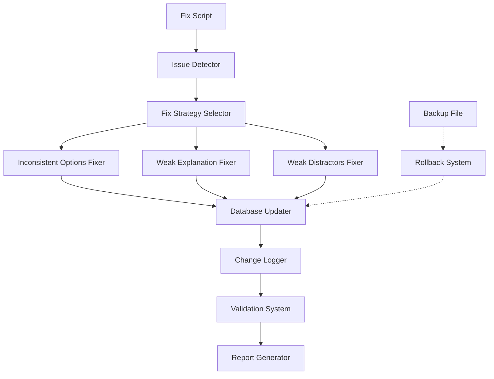

# Design Document: Improve Question Quality

## Overview

This design document specifies a comprehensive system for automatically fixing quality issues in 500 English quiz questions stored in MongoDB. The system addresses three primary issue types identified by the deep quality check: INCONSISTENT_OPTIONS (21 questions), WEAK_EXPLANATION (30 questions), and WEAK_DISTRACTORS (4 questions).

The solution consists of:
1. **Fix Script** - Automated script that applies corrections to questions
2. **Validation System** - Verifies all fixes are correctly applied
3. **Reporting System** - Generates detailed before/after reports
4. **Rollback Mechanism** - Enables recovery if issues occur

### Design Goals

- **Correctness**: All fixes must preserve the pedagogical intent and correct answer
- **Atomicity**: Each question update is atomic to prevent partial updates
- **Traceability**: Every change is logged with before/after states
- **Reversibility**: All changes can be rolled back using the backup file
- **Validation**: Zero quality issues remain after fixes are applied

## Architecture

### High-Level Architecture



### Component Responsibilities

1. **Issue Detector**: Runs quality checks on each question to identify issues
2. **Fix Strategy Selector**: Routes questions to appropriate fixer based on issue type
3. **Fixers**: Apply specific corrections for each issue type
4. **Database Updater**: Performs atomic MongoDB updates
5. **Change Logger**: Records all modifications for reporting
6. **Validation System**: Verifies fixes and detects new issues
7. **Report Generator**: Creates detailed fix reports
8. **Rollback System**: Restores from backup if needed

## Components and Interfaces

### 1. Fix Script (`fix-quality-issues.js`)

**Purpose**: Main orchestrator that coordinates the fixing process

**Interface**:
```javascript
async function runFixes(options = {}) {
  // options: { dryRun: boolean, issueTypes: string[], questionIds: string[] }
  // Returns: { fixed: number, failed: number, report: FixReport }
}
```

**Algorithm**:
```
1. Verify backup file exists
2. Connect to MongoDB
3. Load all questions from database
4. For each question:
   a. Run quality checks to identify issues
   b. For each issue:
      - Select appropriate fixer
      - Apply fix and get updated question
      - Log changes
   c. Update question in database (atomic operation)
   d. Handle errors and continue
5. Run validation on all questions
6. Generate fix report
7. Disconnect from MongoDB
```

### 2. Inconsistent Options Fixer

**Purpose**: Rewrites options to have consistent grammatical structure

**Interface**:
```javascript
function fixInconsistentOptions(question) {
  // Returns: { updatedQuestion, changes: [] }
}
```

**Algorithm**:
```
1. Analyze all four options to determine structure:
   - Count options with subjects (I, he, she, it, they, we, you, the X)
   - Count options without subjects (verb phrases only)
   
2. Determine target structure:
   - If 3+ options have subjects → target: all with subjects
   - If 3+ options lack subjects → target: all without subjects
   - If 2-2 split → analyze question text to determine intent
   
3. For each option that doesn't match target:
   a. If target is "with subject":
      - Identify the implied subject from question context
      - Prepend subject to the option
      - Adjust verb form if needed (e.g., "go" → "I go")
   b. If target is "without subject":
      - Remove the subject from the option
      - Keep only the verb phrase
      
4. Update explanation to match new structure:
   - If structure changed, add note about grammatical form
   - Preserve existing explanation content
   
5. Return updated question with change log
```

**Example**:
```
Before:
Q: "If I _______ more time, I would travel more."
A: had
B: I have
C: I had
D: have

After:
Q: "If I _______ more time, I would travel more."
A: I had
B: I have
C: I had
D: I have

(All options now have subjects for consistency)
```

### 3. Weak Explanation Fixer

**Purpose**: Expands explanations to be detailed and educational

**Interface**:
```javascript
function fixWeakExplanation(question) {
  // Returns: { updatedQuestion, changes: [] }
}
```

**Algorithm**:
```
1. Analyze question to identify grammar concept:
   - Check for conditional markers (if, when, unless)
   - Check for tense markers (yesterday, tomorrow, now)
   - Check for modal verbs (would, could, should, might)
   - Check for passive voice indicators
   - Check for reported speech patterns
   
2. Build enhanced explanation with structure:
   a. Grammar rule statement
      - Format: "This question tests [concept]"
      - Example: "This question tests the second conditional"
      
   b. Rule formula (if applicable)
      - Format: "[Structure formula]"
      - Example: "If + past simple, would + base verb"
      
   c. Correct answer explanation
      - Format: "The correct answer is [X] because [reason]"
      - Include why this form is grammatically correct
      
   d. Common mistakes explanation
      - Format: "Common mistakes: [wrong option] is incorrect because [reason]"
      - Explain 1-2 most tempting wrong answers
      
3. Ensure explanation is at least 100 characters
4. Preserve any existing Vietnamese translation references
5. Return updated question with change log
```

**Example**:
```
Before:
Explanation: "Use past simple in if-clause"

After:
Explanation: "This question tests the second conditional, used for hypothetical situations in the present or future. The structure is: If + past simple, would + base verb. The correct answer is 'had' because we use past simple in the if-clause of second conditional. Common mistakes: 'have' is incorrect because it's present simple, not past simple."
```

### 4. Weak Distractors Fixer

**Purpose**: Rewrites incorrect options to be more distinct and test different concepts

**Interface**:
```javascript
function fixWeakDistractors(question) {
  // Returns: { updatedQuestion, changes: [] }
}
```

**Algorithm**:
```
1. Identify the correct answer and preserve it
2. Analyze what grammar concept is being tested
3. Identify common words shared by all options
4. For each incorrect option:
   a. Determine what mistake it should represent:
      - Option 1: Wrong tense
      - Option 2: Wrong form (e.g., infinitive vs gerund)
      - Option 3: Wrong modal or auxiliary verb
   b. Rewrite to test that specific mistake
   c. Ensure it's distinct from other options
   d. Remove unnecessary common words
   
5. Verify all options are now distinct:
   - Calculate word overlap between options
   - Ensure no more than 1-2 common words
   
6. Update explanation to address the new distractors
7. Return updated question with change log
```

**Example**:
```
Before (too similar):
A: going to go
B: going to going
C: going to went
D: going to goes

After (distinct):
A: going to go (correct)
B: will going (wrong modal form)
C: went (wrong tense)
D: to go (missing auxiliary)
```

### 5. Database Updater

**Purpose**: Performs atomic updates to MongoDB

**Interface**:
```javascript
async function updateQuestion(questionId, updates) {
  // Returns: { success: boolean, error?: string }
}
```

**Implementation**:
```javascript
async function updateQuestion(questionId, updates) {
  try {
    const result = await Question.findByIdAndUpdate(
      questionId,
      { $set: updates },
      { 
        new: true,  // Return updated document
        runValidators: true  // Validate against schema
      }
    );
    
    if (!result) {
      return { success: false, error: 'Question not found' };
    }
    
    return { success: true };
  } catch (error) {
    return { success: false, error: error.message };
  }
}
```

### 6. Validation System

**Purpose**: Verifies all fixes are correctly applied

**Interface**:
```javascript
async function validateFixes() {
  // Returns: ValidationReport
}
```

**Algorithm**:
```
1. Load all 500 questions from database
2. Run deep quality check on each question
3. Count issues by type:
   - INCONSISTENT_OPTIONS
   - WEAK_EXPLANATION
   - WEAK_DISTRACTORS
   - Any new issue types
   
4. Verify expected counts:
   - INCONSISTENT_OPTIONS: 0 (was 21)
   - WEAK_EXPLANATION: 0 (was 30)
   - WEAK_DISTRACTORS: 0 (was 4)
   
5. If any issues remain:
   - Log question IDs with remaining issues
   - Log issue details
   
6. Return validation report with:
   - Before/after counts by issue type
   - List of questions still with issues
   - Success/failure status
```

### 7. Report Generator

**Purpose**: Creates detailed fix reports

**Interface**:
```javascript
function generateReport(changes, validation) {
  // Returns: string (formatted report)
}
```

**Report Structure**:
```
=== QUESTION QUALITY FIX REPORT ===
Generated: [timestamp]

SUMMARY:
- Total questions processed: 500
- Questions fixed: 45
- Questions failed: 0

FIXES BY TYPE:
- INCONSISTENT_OPTIONS: 21 fixed
- WEAK_EXPLANATION: 30 fixed
- WEAK_DISTRACTORS: 4 fixed

VALIDATION RESULTS:
- INCONSISTENT_OPTIONS: 21 → 0 ✓
- WEAK_EXPLANATION: 30 → 0 ✓
- WEAK_DISTRACTORS: 4 → 0 ✓

DETAILED CHANGES:
[For each fixed question]
Question ID: [id]
Set: [setNumber], Order: [orderIndex]
Unit: [unit]
Issues Fixed: [issue types]

Before:
  Question: [original questionText]
  Options: [original options]
  Explanation: [original explanation]

After:
  Question: [updated questionText]
  Options: [updated options]
  Explanation: [updated explanation]

Changes:
  - [field]: [description of change]

---
```

### 8. Rollback System

**Purpose**: Restores database from backup if needed

**Interface**:
```javascript
async function rollback(backupFile) {
  // Returns: { success: boolean, restored: number }
}
```

**Algorithm**:
```
1. Verify backup file exists and is valid JSON
2. Load backup data
3. Connect to MongoDB
4. For each question in backup:
   a. Find question by _id
   b. Replace entire document with backup version
   c. Log restoration
5. Verify restoration:
   - Count restored questions
   - Run quality check to verify state
6. Return restoration report
```

## Data Models

### Question Model (Existing)

```javascript
{
  _id: ObjectId,
  questionText: String (required),
  options: {
    A: String (required),
    B: String (required),
    C: String (required),
    D: String (required)
  },
  correctAnswer: String (enum: ['A','B','C','D'], required),
  explanation: String (required),
  vietnameseTranslation: String (optional),
  optionTranslations: {
    A: String (optional),
    B: String (optional),
    C: String (optional),
    D: String (optional)
  },
  unit: String (enum: ['Unit 1',...,'Vocabulary'], required),
  orderIndex: Number (required),
  setNumber: Number (1-10, required),
  commonMistake: String (optional),
  difficulty: String (enum: ['easy','medium','hard'], required),
  setDifficulty: String (enum: ['easy','medium','hard'], required),
  timestamps: { createdAt, updatedAt }
}
```

### Change Log Entry

```javascript
{
  questionId: ObjectId,
  setNumber: Number,
  orderIndex: Number,
  unit: String,
  issueTypes: String[],
  timestamp: Date,
  changes: [
    {
      field: String,  // 'questionText', 'options.A', 'explanation', etc.
      before: String,
      after: String,
      reason: String  // Why this change was made
    }
  ]
}
```

### Validation Report

```javascript
{
  timestamp: Date,
  totalQuestions: Number,
  issuesBefore: {
    INCONSISTENT_OPTIONS: Number,
    WEAK_EXPLANATION: Number,
    WEAK_DISTRACTORS: Number
  },
  issuesAfter: {
    INCONSISTENT_OPTIONS: Number,
    WEAK_EXPLANATION: Number,
    WEAK_DISTRACTORS: Number,
    [newIssueType]: Number  // Any new issues introduced
  },
  questionsWithIssues: [
    {
      questionId: ObjectId,
      setNumber: Number,
      orderIndex: Number,
      issues: [
        {
          type: String,
          severity: String,
          message: String
        }
      ]
    }
  ],
  success: Boolean  // True if all target issues are fixed
}
```

### Fix Report

```javascript
{
  timestamp: Date,
  summary: {
    totalProcessed: Number,
    totalFixed: Number,
    totalFailed: Number,
    byIssueType: {
      INCONSISTENT_OPTIONS: Number,
      WEAK_EXPLANATION: Number,
      WEAK_DISTRACTORS: Number
    }
  },
  changes: ChangeLogEntry[],
  validation: ValidationReport,
  errors: [
    {
      questionId: ObjectId,
      error: String
    }
  ]
}
```

## Error Handling

### Error Categories

1. **Database Connection Errors**
   - Retry connection up to 3 times with exponential backoff
   - If all retries fail, exit with error message
   - Log connection parameters (excluding credentials)

2. **Backup File Errors**
   - If backup file doesn't exist, exit immediately with error
   - If backup file is corrupted, exit immediately with error
   - Log backup file path and size

3. **Question Update Errors**
   - Log error details (question ID, error message)
   - Continue processing remaining questions
   - Include failed questions in final report

4. **Validation Errors**
   - If validation fails (issues remain), report details
   - Do not rollback automatically
   - Provide manual rollback instructions

5. **Schema Validation Errors**
   - If updated question violates schema, log error
   - Do not update that question
   - Continue with remaining questions

### Error Handling Strategy

```javascript
try {
  // Verify backup exists
  if (!fs.existsSync(backupFile)) {
    throw new Error(`Backup file not found: ${backupFile}`);
  }
  
  // Connect to database with retry
  await connectWithRetry(3);
  
  // Process questions
  for (const question of questions) {
    try {
      const fixed = await fixQuestion(question);
      await updateQuestion(question._id, fixed);
      logSuccess(question._id);
    } catch (error) {
      logError(question._id, error);
      errors.push({ questionId: question._id, error: error.message });
      // Continue with next question
    }
  }
  
  // Validate
  const validation = await validateFixes();
  if (!validation.success) {
    console.warn('Validation failed - some issues remain');
    console.log('Rollback command: node rollback.js');
  }
  
} catch (error) {
  console.error('Fatal error:', error.message);
  process.exit(1);
}
```

## Testing Strategy

This feature involves data transformation and database operations, making it suitable for example-based testing rather than property-based testing. The testing strategy focuses on:

### Unit Tests

1. **Fixer Function Tests**
   - Test each fixer with representative examples
   - Verify correct transformations
   - Verify change logs are accurate

2. **Issue Detection Tests**
   - Test quality check functions with known good/bad questions
   - Verify correct issue identification

3. **Validation Tests**
   - Test validation logic with mock data
   - Verify correct counting and reporting

### Integration Tests

1. **Database Operation Tests**
   - Test atomic updates with test database
   - Verify schema validation
   - Test rollback functionality

2. **End-to-End Tests**
   - Run fix script on test database with known issues
   - Verify all issues are fixed
   - Verify no data loss

### Manual Testing

1. **Sample Question Review**
   - Manually review 10 fixed questions from each issue type
   - Verify pedagogical correctness
   - Verify explanations are clear and accurate

2. **Backup and Rollback Test**
   - Test rollback on test database
   - Verify complete restoration

### Test Data

Create test questions representing each issue type:

```javascript
const testQuestions = [
  {
    // INCONSISTENT_OPTIONS example
    questionText: "If I _______ rich, I would buy a house.",
    options: {
      A: "am",
      B: "I were",
      C: "was",
      D: "I was"
    },
    correctAnswer: "C",
    explanation: "Use past simple"
  },
  {
    // WEAK_EXPLANATION example
    questionText: "She _______ to school every day.",
    options: {
      A: "go",
      B: "goes",
      C: "going",
      D: "went"
    },
    correctAnswer: "B",
    explanation: "Present simple"  // Too short
  },
  {
    // WEAK_DISTRACTORS example
    questionText: "I am _______ to the store.",
    options: {
      A: "going to go",
      B: "going to going",
      C: "going to went",
      D: "going to goes"
    },
    correctAnswer: "A",
    explanation: "Use 'going to' for future plans"
  }
];
```

## Implementation Plan

### Phase 1: Core Infrastructure (Day 1)

1. Create fix script skeleton
2. Implement database connection with retry
3. Implement backup verification
4. Implement change logging system
5. Create test database with sample questions

### Phase 2: Fixer Implementation (Day 2-3)

1. Implement Inconsistent Options Fixer
   - Write algorithm
   - Test with examples
   - Handle edge cases

2. Implement Weak Explanation Fixer
   - Write grammar concept detector
   - Write explanation template system
   - Test with examples

3. Implement Weak Distractors Fixer
   - Write distractor analysis
   - Write rewriting logic
   - Test with examples

### Phase 3: Validation and Reporting (Day 4)

1. Implement validation system
2. Implement report generator
3. Test end-to-end on test database

### Phase 4: Production Run (Day 5)

1. Run fix script on production database
2. Review generated report
3. Manually review sample of fixed questions
4. Run validation
5. Commit changes to git

### Phase 5: Deployment (Day 6)

1. Push to production branch
2. Verify deployment
3. Monitor for issues
4. Document rollback procedure

## Deployment Strategy

### Pre-Deployment Checklist

- [ ] Backup file exists and is valid
- [ ] Fix script tested on test database
- [ ] All unit tests pass
- [ ] Manual review of test fixes completed
- [ ] Rollback script tested

### Deployment Steps

1. **Verify Backup**
   ```bash
   ls -lh backend/scripts/backup-1778265162622.json
   ```

2. **Run Fix Script**
   ```bash
   cd backend/scripts
   node fix-quality-issues.js
   ```

3. **Review Report**
   ```bash
   cat fix-report-[timestamp].txt
   ```

4. **Verify Validation**
   - Check that all issue counts are zero
   - Review any unexpected issues

5. **Manual Spot Check**
   - Review 5 random fixed questions
   - Verify correctness

6. **Commit Changes**
   ```bash
   git add .
   git commit -m "fix: improve question quality - fixed 45 questions (21 inconsistent options, 30 weak explanations, 4 weak distractors)"
   git push origin main
   ```

### Rollback Procedure

If issues are detected after deployment:

1. **Stop any ongoing processes**

2. **Run rollback script**
   ```bash
   node rollback.js backend/scripts/backup-1778265162622.json
   ```

3. **Verify rollback**
   ```bash
   node deep-quality-check.js
   ```

4. **Investigate issues**
   - Review fix report
   - Identify what went wrong
   - Fix the fix script

5. **Re-test and re-deploy**

## Security Considerations

1. **Database Credentials**
   - Use environment variables for MongoDB URI
   - Never commit credentials to git
   - Use read-only credentials for validation

2. **Backup File**
   - Store backup in secure location
   - Verify backup integrity before fixes
   - Keep backup for at least 30 days

3. **Atomic Operations**
   - Use MongoDB transactions if available
   - Ensure each update is atomic
   - Prevent partial updates

4. **Access Control**
   - Limit who can run fix scripts
   - Log all fix operations
   - Require approval for production runs

## Performance Considerations

1. **Batch Processing**
   - Process questions in batches of 50
   - Add small delay between batches to avoid overwhelming database

2. **Database Indexing**
   - Ensure indexes exist on _id, setNumber, orderIndex
   - Use lean() queries when possible

3. **Memory Management**
   - Stream large reports to file instead of keeping in memory
   - Clear processed questions from memory

4. **Execution Time**
   - Expected: ~5-10 minutes for 500 questions
   - Monitor progress with console output

## Monitoring and Logging

### Log Levels

1. **INFO**: Normal operation progress
   - "Processing question 50/500"
   - "Fixed INCONSISTENT_OPTIONS in question 123"

2. **WARN**: Non-fatal issues
   - "Question 456 has no issues to fix"
   - "Validation found 2 remaining issues"

3. **ERROR**: Fatal issues
   - "Failed to update question 789: [error]"
   - "Database connection failed"

### Log Format

```
[2024-01-15 10:30:45] [INFO] Starting fix process
[2024-01-15 10:30:46] [INFO] Backup verified: backup-1778265162622.json
[2024-01-15 10:30:47] [INFO] Connected to MongoDB
[2024-01-15 10:30:48] [INFO] Processing question 1/500
[2024-01-15 10:30:49] [INFO] Fixed INCONSISTENT_OPTIONS in Q1 (Set 1, Order 5)
[2024-01-15 10:30:50] [ERROR] Failed to update Q2: Validation error
[2024-01-15 10:35:00] [INFO] Completed: 45 fixed, 1 failed
[2024-01-15 10:35:01] [INFO] Running validation...
[2024-01-15 10:35:05] [INFO] Validation passed: 0 issues remaining
```

## Success Criteria

The implementation is successful when:

1. ✅ All 21 INCONSISTENT_OPTIONS issues are fixed
2. ✅ All 30 WEAK_EXPLANATION issues are fixed
3. ✅ All 4 WEAK_DISTRACTORS issues are fixed
4. ✅ Validation shows zero issues of target types
5. ✅ No new issues introduced
6. ✅ All 500 questions remain in database
7. ✅ All schema constraints satisfied
8. ✅ Fix report generated successfully
9. ✅ Manual review confirms quality improvements
10. ✅ Changes committed to git

## Future Enhancements

1. **AI-Assisted Fixing**
   - Use LLM to generate better explanations
   - Use LLM to suggest better distractors

2. **Continuous Quality Monitoring**
   - Run quality checks on new questions before insertion
   - Prevent issues from being introduced

3. **Quality Metrics Dashboard**
   - Track quality scores over time
   - Visualize issue trends

4. **Automated Testing**
   - Generate test cases from questions
   - Verify student performance improves with better questions

